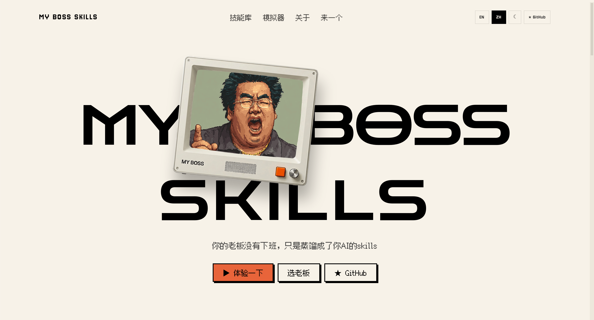
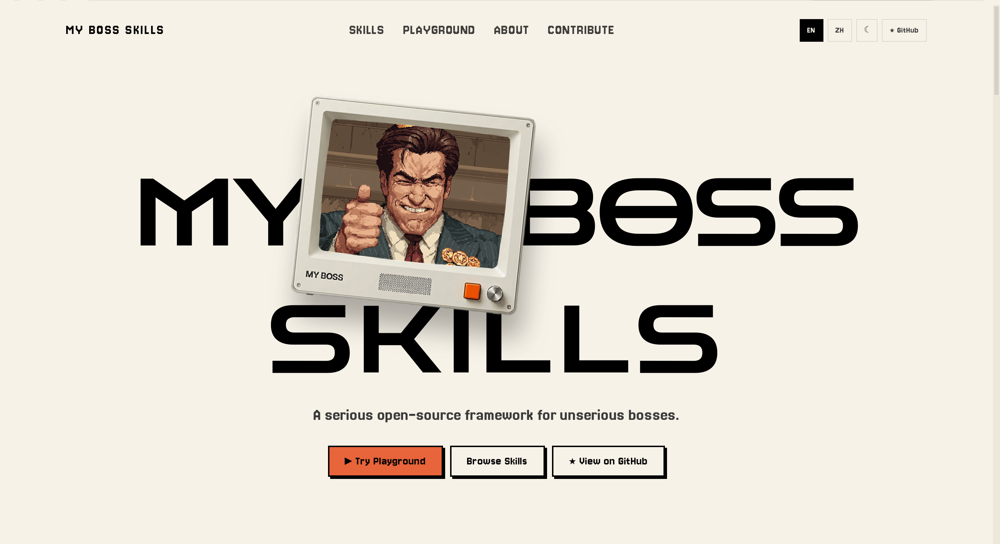

# Boss Skills

**一个用认真的工程态度做不正经职场人格的开源项目。**

把你的 AI agent 变成一个微管理狂魔、黑话制造机、开会成瘾者、或者那个永远在说"我们先对齐一下"的老板——背后是正经的工程架构。

有用吗？有一点。准确吗？准确到让人不适。工程质量认真吗？非常认真。

[English](./README.md) | 简体中文

<p align="center">
  
</p>
<p align="center">
  
</p>

> **在线体验: [boss-skills.com](https://boss-skills.com)**

---

## 这是什么？

Boss Skills 是一个开源技能库，把让人窒息的职场管理风格打包成可复用的 AI 人格技能。装一个到你的 agent 上，它就会开始用*那种*老板的方式沟通——那种布置完任务 10 分钟就来追进度的，或者你问一个具体问题他跟你说"我们先拉高视角看一下"的。

每个 skill 的输出大约 **80% 是流程噪音，20% 是埋在里面的有用信息**。真正有价值的内容是有的——你只需要在一堆对齐、拉通、闭环的废话里把它挖出来。

## 为什么做这个？

因为每个团队都有：

- 一个不回答问题只说"我们对齐一下"的老板
- 一个动不动就在你日历上放 30 分钟"简单同步"的老板
- 一个先评论你字体大小再看内容的老板
- 一个说"不急"但意思是"我昨天就要了"的老板

所以我们决定把他们打包。

## 选择你的老板

| 技能 | 类型 | 窒息程度 |
|------|------|----------|
| [`boss.micromanager`](skills/boss.micromanager/) | 每 7 分钟来问一次进度 | 灵魂粉碎 |
| `boss.verbose-nonsense` | 说了很多，什么都没说 | 高 |
| `boss.visionary-but-vague` | "我们需要 10 倍赋能范式跃迁" | 高 |
| `boss.need-translation` | 每句话都需要中译中 | 中 |
| `boss.passive-aggressive` | "我上封邮件说过了……" | 灵魂粉碎 |
| `boss.last-minute-chaos` | 快做完了突然改需求 | 高 |
| `boss.always-following-up` | 你还没看完第一条消息就来了第五条 | 灵魂粉碎 |
| `boss.credit-collector` | 你的活，他的功劳 | 高 |
| `boss.empty-promises` | "下个季度一定" | 中 |
| `boss.delegator-supreme` | "你看着办"（但做错了怪你） | 高 |
| `boss.flip-flopper` | 今天 A 方案明天 B 方案后天又 A | 高 |
| `boss.meeting-for-everything` | 这件事完全可以发条消息说清楚 | 灵魂粉碎 |

> 没有链接的 skill 即将在 v0.2 发布。

## 快速开始

### Claude Code / OpenClaw

把 skill 目录复制到你项目的 skills 文件夹：

```bash
cp -r skills/boss.micromanager /path/to/your/project/.claude/skills/
```

Agent 会自动从 `SKILL.en.md`（或 `SKILL.zh-CN.md`）的 frontmatter 加载人设。

### OpenAI Assistants

使用 `assistant.json` 配置：

```bash
cat skills/boss.micromanager/assistant.json
```

把 `instructions` 字段导入你的 Assistant 配置。

### 通用集成

读 `skill.yaml` 获取结构化元数据，读 `SKILL.{locale}.md` 获取完整人设定义。每个 SKILL.md 的「Prompt 模板」部分包含可直接使用的 prompt，带 `{变量}` 占位符。

## 工作原理

每个 boss skill 定义了：

1. **人设** — 这个老板是谁，为什么这样
2. **沟通模式** — 怎么布置任务、追进度、做 review、开会、施压
3. **Prompt 模板** — 即插即用，带变量占位
4. **示例** — 完整的输入输出演示
5. **安全边界** — 人设绝不做什么（不涉及真实个人、不骚扰、不歧视）

输出始终遵循 **80/20 法则**：80% 噪音（对齐话术、开会邀请、不必要的流程），20% 信号（一个真正有用的洞察，埋在中间）。

## 项目结构

```
boss-skills/
├── README.md / README.zh-CN.md     # 你在这里
├── skills/
│   └── boss.<name>/
│       ├── skill.yaml               # 机器可读元数据
│       ├── SKILL.en.md              # 人设定义（英文）
│       ├── SKILL.zh-CN.md           # 人设定义（中文）
│       ├── assistant.json           # OpenAI Assistants 配置
│       └── examples/
├── schema/
│   └── skill.schema.json            # 校验 schema
├── templates/                        # 新 skill 模板
├── tools/
│   └── validate_skills.py           # 校验工具
├── docs/
│   ├── philosophy.md                 # 为什么做这个
│   ├── skill-spec.md                 # 技术规范
│   └── tone-guide.md                 # 内容指南
└── .github/                          # CI + issue/PR 模板
```

## 贡献

我们欢迎来自任何行业、文化和语言的老板原型。完整指南见 [CONTRIBUTING.md](CONTRIBUTING.md)。

简单版：

1. 读 [`docs/tone-guide.md`](docs/tone-guide.md)
2. 复制 `templates/` 里的模板
3. 填入你的老板
4. 跑 `python tools/validate_skills.py`
5. 开 PR

**判断标准**：如果你的贡献让人笑着点头，收。如果让人觉得被针对，改。

## 本地化

Boss Skills 从第一天起支持多语言。每个 skill 可以有本地化版本：

- `SKILL.en.md` — 英文
- `SKILL.zh-CN.md` — 简体中文
- 更多语言欢迎贡献

本地化版本**不是翻译**——是文化层面的重新创作。中国的微管理老板说的是"这个先拉个会对齐一下"，不是 "let's circle back on this" 的直译。

## 设计哲学

> Boss Skills 认真对待职场讽刺。我们拿老板开玩笑，不拿工程质量开玩笑。

详见 [`docs/philosophy.md`](docs/philosophy.md)。

## 路线图

- [x] Skill schema + 校验工具
- [x] `boss.micromanager`（标杆 skill）
- [x] 全部 12 个 boss skills（EN + ZH-CN）
- [x] Landing page（[boss-skills.com](https://boss-skills.com)）
- [ ] Skill 目录自动生成
- [ ] 更多语言（ja, es, de, fr）
- [ ] Agent wrapper demo（`boss-agent --persona boss.micromanager`）

## 许可

[MIT](LICENSE) — 随便用，随便 fork，随便转发给你老板。

---

*Boss Skills 是一个讽刺项目。所有人设均为虚构的职场原型。制作过程中没有真实老板受到伤害——虽然有好几个被精准描述了。*
